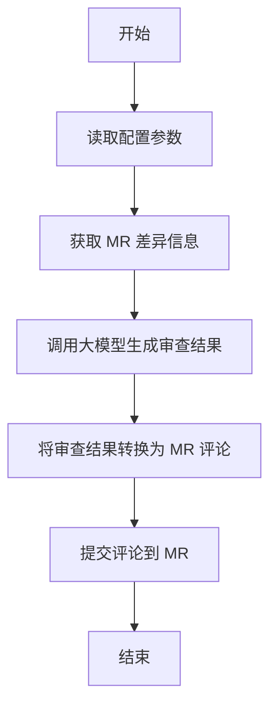

# Flow 自定义AI代码审核步骤

Flow 自定义AI代码审核步骤，用于自动化 AI 代码审核。该步骤通过调用大模型（如 Qwen、DeepSeek）对 Codeup 的合并请求（MR）进行自动审查，并提交评论。

## 功能介绍

- **AI 代码审查**：使用大模型（Qwen、DeepSeek 等）对 MR 进行代码审查。
- **问题检测**：聚焦于冗余代码、逻辑错误、潜在问题、SQL 性能优化等关键维度。
- **自动生成评论**：根据模型输出的问题，自动在 MR 上提交评论。
- **支持多种模型**：可选择不同的大模型进行代码审查。

## 流程图




## 自定义参数说明

| 参数名称             | 类型     | 描述                                                                 |
|----------------------|----------|----------------------------------------------------------------------|
| `modelName`          | 下拉框   | 模型名称，支持 `deepseek-r1`, `deepseek-v3`, `qwen-max`, `qwen-turbo-latest`, `qwen-turbo`, `qwen-plus` |
| `yunxiaoToken`       | 输入框   | 云效 Token，可在流水线编辑页的变量与缓存中配置                       |
| `dashscopeApikey`    | 输入框   | 百炼 API Key，可在流水线编辑页的变量与缓存中配置                     |
| `llmChatPrompt`      | 输入框   | 大模型提示词，默认提供了一套标准的审查要求                           |

## 输出结果

- **审查结果**：大模型生成的审查结果，包括冗余代码、逻辑错误、潜在问题、SQL 性能优化等问题。
- **MR 评论**：根据审查结果，自动在 MR 上提交评论，指出具体问题。

## 如何配置

1. **安装依赖**

   ```bash
   npm install --registry=https://registry.npmmirror.com
   ```


2. **测试运行**

   ```bash
   npm run test
   ```


3. **构建并运行**

   ```bash
   npm run build
   node dist/index.js
   ```


4. **配置流水线**

    - 在流水线编辑页的变量与缓存中配置 `YUNXIAO_TOKEN` 和 `BAILIAN_APIKEY`。
    - 配置 [step.yaml](file:///Users/hehui/dev/git/jiuyu/yunxiao-mr-review-step/step.yaml) 中的参数，确保参数值正确。

5. **执行流程**

    - 当流水线触发时，会自动执行 [index.ts](file:///Users/hehui/dev/git/jiuyu/yunxiao-mr-review-step/node_modules/@flow-step/step-toolkit/src/index.ts) 中的逻辑。
    - 获取 MR 差异信息后，调用大模型生成审查结果。
    - 将审查结果转换为 MR 评论，并提交到对应的 MR。

## 开发文档

### 主要文件

- [code_review_patch.ts](file:///Users/hehui/dev/git/jiuyu/yunxiao-mr-review-step/src/code_review_patch.ts)：处理 MR 差异信息。
- [code_source.ts](file:///Users/hehui/dev/git/jiuyu/yunxiao-mr-review-step/src/code_source.ts)：定义代码来源信息。
- [params.ts](file:///Users/hehui/dev/git/jiuyu/yunxiao-mr-review-step/src/params.ts)：定义和获取参数。
- [index.ts](file:///Users/hehui/dev/git/jiuyu/yunxiao-mr-review-step/node_modules/@flow-step/step-toolkit/src/index.ts)：主入口文件。
- [codeup_client.ts](file:///Users/hehui/dev/git/jiuyu/yunxiao-mr-review-step/src/codeup_client.ts)：与 Codeup 交互的客户端。

### 核心类

- [CodeReviewPatch](file:///Users/hehui/dev/git/jiuyu/yunxiao-mr-review-step/src/code_review_patch.ts#L0-L6)：表示 MR 差异中的单个补丁集。
- [CodeReviewPatches](file:///Users/hehui/dev/git/jiuyu/yunxiao-mr-review-step/src/code_review_patch.ts#L8-L45)：处理多个补丁集。
- [CompareResult](file:///Users/hehui/dev/git/jiuyu/yunxiao-mr-review-step/src/code_review_patch.ts#L69-L185)：处理差异结果，提取 Hunk 信息。
- [CodeupClient](file:///Users/hehui/dev/git/jiuyu/yunxiao-mr-review-step/src/codeup_client.ts#L6-L96)：与 Codeup 交互的客户端，负责获取差异和提交评论。

### 主要逻辑

- **获取差异**：通过 [CodeupClient.getDiffPatches()](file:///Users/hehui/dev/git/jiuyu/yunxiao-mr-review-step/src/codeup_client.ts#L24-L39) 获取 MR 差异信息。
- **生成审查结果**：调用大模型生成审查结果。
- **提交评论**：通过 [CodeupClient.commentOnMR()](file:///Users/hehui/dev/git/jiuyu/yunxiao-mr-review-step/src/codeup_client.ts#L58-L90) 提交评论到 MR。

通过以上配置和流程，可以实现自动化 AI 代码审核，提高代码质量和开发效率。